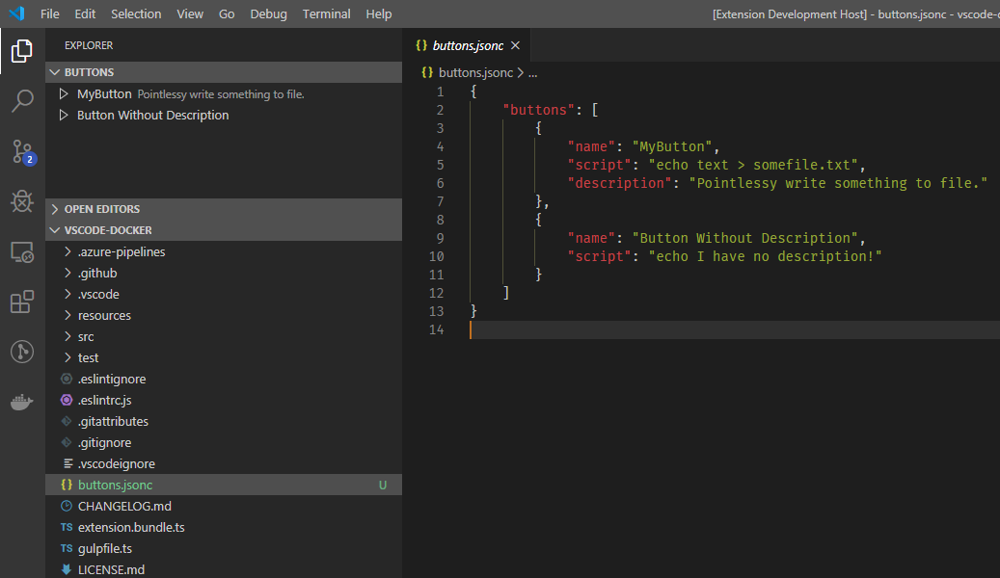

# vscode-buttons 

Do you want to be able to make buttons to do whatever you want? This extension will let you do that!



## Features

You will get some clickable buttons which will run customisable scripts, wow! To create buttons, create a file called 'buttons.jsonc' in the root directory of your workspace. It should look like:

```json
{
    "buttons": [
        {
            "name": "MyButton",
            "script": "echo text > somefile.txt",
            "description": "Pointlessy write something to file."
        },
        {
            "name": "Button Without Description",
            "script": "echo I have no description!"
        }
    ]
}
```